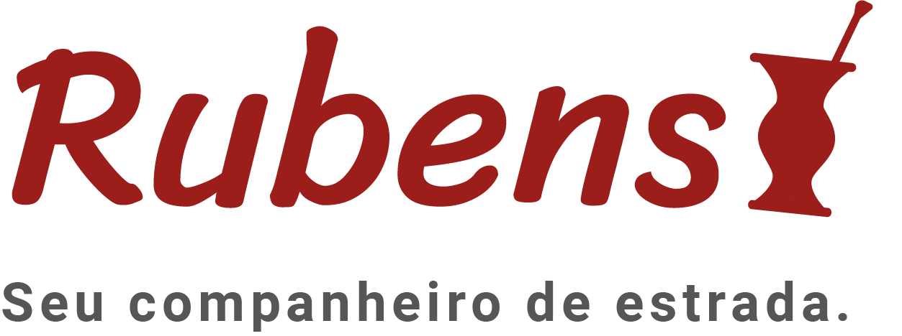
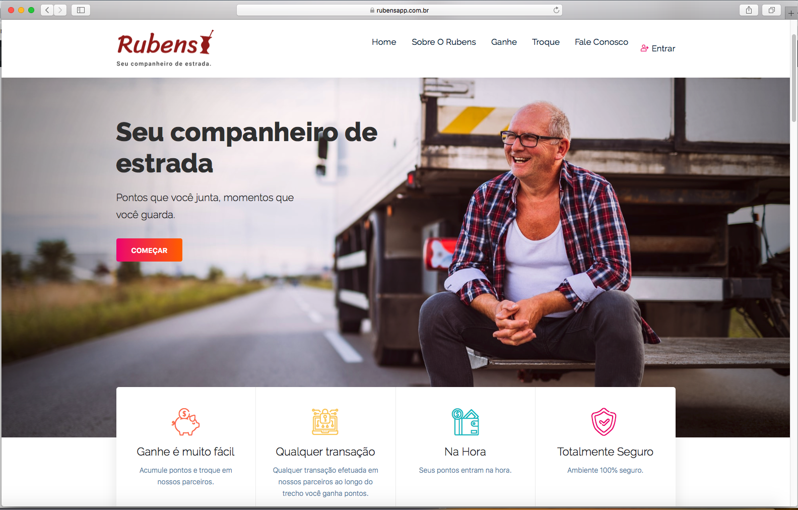

<h3 align="center">
    
    <br><br>
    <b>Seu novo companheiro de boleia</b>  
    <br>
</h3>

<p align="center">
  <br>
</p>

# Índice

- [Sobre](#sobre)
- [Tecnologias Utilizadas](#tecnologias-utilizadas)
- [Como Usar](#como-usar)

<a id="sobre"></a>

## :bookmark: Sobre

O <strong>Rubens App</strong> é uma aplicação Web e Mobile para ajudar os caminhoneiros no seu dia a dia.

Essa aplicação foi construída para o <strong> Hackathon CCR </strong>. A ideia de criar uma aplicação voltada para os caminhoneiros como um assistente pessoal.


<a id="tecnologias-utilizadas"></a>

## :rocket: Tecnologias Utilizadas

O projeto foi desenvolvido utilizando as seguintes tecnologias

- [Flutter](https://www.flutter.dev)
- [Html]
- [Javascript]


## :heavy_check_mark: Resultado Web:


<h1 align="center">
    
</h1>

<a id="como-usar"></a>

## :fire: Como usar

1. Faça um clone :

```sh
  $ git clone https://github.com/LeonTenorio/HackathonCCR.git
```

2. Executando a Aplicação:

```sh
  # Rode
  $ Abra o arquivo index.html


  # Inicie a aplicação mobile
  $ cd hackathon_ccr
  $ ...
```

## :memo: License

Esse projeto está sob a licença MIT. Veja o arquivo [LICENSE](LICENSE.md) para mais detalhes.

---

<h4 align="center">
    Feito com 💜
</h4>
